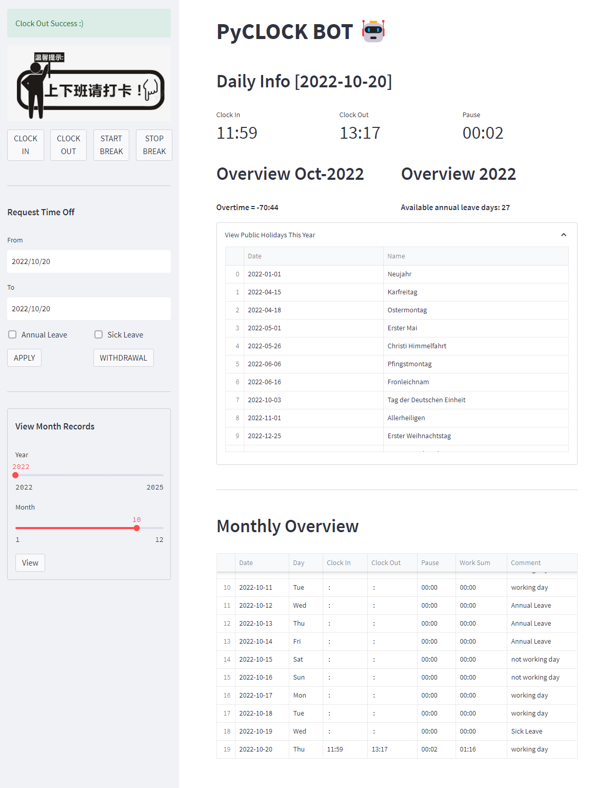

# Welcome to PyCLOCK BOT 🤖

PyCLOCK BOT is a daily clock in & out system. It is a web application written in Python based on the libraries of *Pandas* and *Streamlit*.

## Features

- Dashboards display the daily, monthly and yearly information.
- Macros for different countries and working principles (e.g. weekly working time and annual leave days etc.). Users can change those macros to accommodate the situation.
- Simple and neat interface, the month report is displayed in a tabular view.
- The yearly report is generated under the repository ***docs***, each monthly report is saved in a separate sheet.
- Multiple break sessions are involved. It is allowed for users to set different breaks in a day, and the actual working hour will be self adapted.
 
## Run

```python pyclock_bot.py```

## Example



The working conditions can be modified as macros in file `./src/backend.py`. The supported country codes please refer https://pypi.org/project/holidays/

```
COUNTRY = 'DE'
STATE = 'NW'
ANNUAL_LEAVE_DAYS = 30
WEEKLY_WORKING_HOURS = 40
WEEKLY_WORKING_DAYS = 5
DAILY_WORKING_HOURS = int(WEEKLY_WORKING_HOURS / WEEKLY_WORKING_DAYS)
```

## Built With

* [Stremlit](https://streamlit.io/) - A faster way to build and share data apps
* [Pandas](https://pandas.pydata.org/) - pandas is a fast, powerful, flexible and easy to use open source data analysis and manipulation tool,
built on top of the Python programming language.

## License

This project is licensed under the MIT License - see the [LICENSE](LICENSE) file for details

